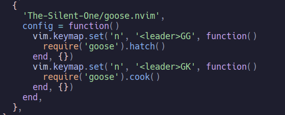

# goose.nvim
a goose that rains terror on your vim IDE

<!-- TABLE OF CONTENTS -->

  
Table of Contents

  <ol>
    <li>
      <a href="#about">About</a>
    </li>
    <li>
        <a href="#installation">Installation</a>
    </li>
    <li>
        <a href="#to-do">To-do</a>
    </li>
    <li>
        <a href="#license">License</a>
    </li>
  </ol>

## About

a neovim plugin that brings a goose that moves and honkes and keeps you entertained. This plugin was inspired by [duck.nvim](https://github.com/tamton-aquib/duck.nvim).

(<a href="#readme-top">back to top</a>)

## Installation

add the plugin to your init.lua file like this:

You should configure the keymaps inside the config function

(<a href="#readme-top">back to top</a>)

## To-do

<ul>
    <li>
        Improve honk function
    </li>
    <li>
        Make goose able to interact with editor (steal a character?)
    </li>
    <li>
        Make goose stop and ponder
    </li>
    <li>
        Make goose interactable with cursor/mouse click
    </li>
    <li>
        Give goose the ability to fight back
    </li>
    <li>
        Improve cooking effects
    </li>
</ul>

(<a href="#readme-top">back to top</a>)

## License

Distributed under the MIT license. See 'License.txt' for more information.

(<a href="#readme-top">back to top</a>)

